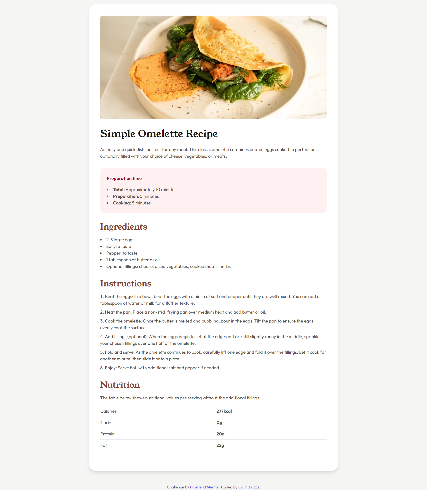

# Frontend Mentor - Recipe page solution

This is a solution to the [Recipe page challenge on Frontend Mentor](https://www.frontendmentor.io/challenges/recipe-page-KiTsR8QQKm). Frontend Mentor challenges help you improve your coding skills by building realistic projects.

## Table of contents

- [Overview](#overview)
  - [Screenshot](#screenshot)
  - [Links](#links)
- [My process](#my-process)
  - [Built with](#built-with)
  - [What I learned](#what-i-learned)
  - [Continued development](#continued-development)
  - [Useful resources](#useful-resources)
- [Author](#author)

## Overview

### Screenshot



### Links

- Solution URL: [https://github.com/chadittya/recipe-page-main]
- Live Site URL: [https://recipe-page-main-galiharizza.vercel.app/]

## My process

### Built with

- [Next.js](https://nextjs.org/) - React framework
- [Tailwind CSS](https://tailwindcss.com/) - For styles
- Semantic HTML5 markup
- Flexbox
- Mobile-first workflow
- [React](https://reactjs.org/) - JS library

### What I learned

In this project, I learned how to:

1. Set up a Next.js project with Tailwind CSS
2. Use Next.js font optimization with Google Fonts
3. Create reusable React components for a recipe page
4. Implement responsive design using Tailwind CSS
5. Use CSS custom properties for consistent theming

Here's an example of how I used Next.js font optimization:

```tsx
import { Young_Serif, Outfit } from "next/font/google";

const youngSerif = Young_Serif({ subsets: ["latin"], weight: ["400"] });
const outfit = Outfit({ subsets: ["latin"], weight: ["400", "600", "700"] });
```

### Continued development

In future projects, I want to focus on:

- Improving accessibility features
- Implementing more complex layouts with CSS Grid
- Exploring Next.js API routes for dynamic content

### Useful resources

- [Next.js Documentation](https://nextjs.org/docs) - This helped me understand the basics of Next.js and its features.
- [Tailwind CSS Documentation](https://tailwindcss.com/docs) - An excellent resource for learning how to use Tailwind CSS effectively.

## Author

- Frontend Mentor - [@chadittya](https://www.frontendmentor.io/profile/chadittya)
- Twitter - [@galiharizza](https://www.twitter.com/galiharizza)
